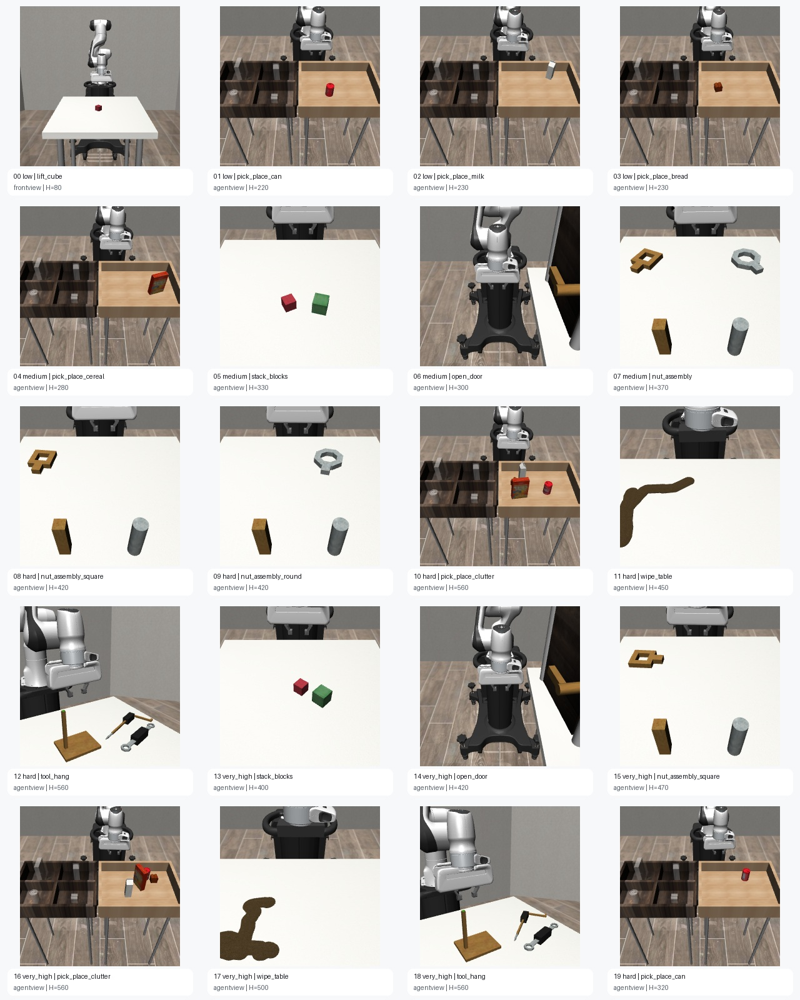

# Robotics VLA Training Node Quickstart

This quickstart shows how to train and submit a policy for the [FLock AI Arena](https://flock.io) Robotics VLA task.

The task is a vision-language-action robotics benchmark. A submitted policy controls a simulated 7-DOF Panda robot arm from camera observations, robot proprioception, and a natural-language instruction. The policy must output one action vector per step:

```text
[Δx, Δy, Δz, Δroll, Δpitch, Δyaw, gripper]   ← 7 floats in [-1, 1]
```

The validator clips actions to `[-1, 1]`. Do not use simulator state or raw object positions in the submitted policy — the adapter receives only the validator observation dict.



<video controls src="assets/multi_object_sorting.mp4" title="Multi-object sorting example"></video>

---

## Quick Start

Install dependencies, then train and export a submission-ready policy from the public HF training dataset:

```bash
python3 -m venv .venv && source .venv/bin/activate
pip install --upgrade pip && pip install -r requirements.txt

python3 scripts/train_basic_vla.py --out outputs/basic_vla_policy
```

The script loads `random-sequence/flock-robotics-vla-training-v2` automatically if no local zip is present. See [Baseline Trainer](#baseline-trainer) for all options.

---

## Setup

Use Python 3.10, 3.11, or 3.12. A CUDA GPU is recommended for serious training.

```bash
python3 -m venv .venv
source .venv/bin/activate
pip install --upgrade pip
pip install -r requirements.txt
```

If your platform needs a specific PyTorch CUDA wheel, install PyTorch from the official command for your CUDA version first, then run `pip install -r requirements.txt`.

---

## Training Dataset

The official training dataset is available on HuggingFace:

```
random-sequence/flock-robotics-vla-training-v2
```

**103 successful demonstration trajectories · 25,328 timesteps · 13 task families.**

All demonstrations end with task success. Every row in the Parquet dataset is one timestep:

| Column | Type | Description |
|--------|------|-------------|
| `episode_id` | string | Unique trajectory identifier |
| `task` | string | Task name (e.g. `lift_cube`, `pick_place_can`) |
| `instruction` | string | Natural-language instruction |
| `difficulty` | string | `low`, `medium`, `hard`, or `very_high` |
| `seed` | int | Environment seed used during recording |
| `step` | int | Timestep index within the episode |
| `horizon` | int | Total episode length in steps |
| `image` | PIL Image | RGB camera frame, 96 × 96 pixels |
| `proprio` | float32[25] | Joint pos/vel, end-effector pose, gripper state |
| `action` | float32[7] | Demonstrated action clipped to `[-1, 1]` |
| `reward` | float32 | Shaped task reward at this step |
| `done` | bool | Episode termination flag |

Task families covered:

```text
lift_cube          pick_place_can     pick_place_milk    pick_place_bread
pick_place_cereal  pick_place_clutter stack_blocks       open_door
nut_assembly       nut_assembly_square nut_assembly_round wipe_table
tool_hang
```

**Image resolution note:** Training images are 96 × 96. The validator renders at 224 × 224 during evaluation. The included baseline adapter resizes eval images to 96 × 96 before inference. For stronger VLA models, pre-upsample training images or design your model to accept variable resolutions.

---

## Submission Contract

Push a HuggingFace model repository containing at least:

```text
flock_robotics_adapter.py   ← required; defines load_policy and the policy's act method
model weights               ← *.safetensors or *.pt / *.bin files
config files                ← anything the adapter needs at load time
```

### Adapter interface

The validator imports `flock_robotics_adapter.py` from the HF repo root and calls:

```python
# Called once at validation startup
policy = load_policy(model_dir: str, device: str, dtype: str)

# Called once per environment step
action: np.ndarray = policy.act(obs: dict)
```

`act()` must return a `(7,)` `float32` NumPy array. Values outside `[-1, 1]` are clipped by the validator.

### Observation dict keys

```python
obs = {
    "image":       np.ndarray,   # uint8, shape (H, W, 3), agentview camera — 224×224 at eval
    "instruction": str,          # natural-language task description
    "proprio":     np.ndarray,   # float32 (25,) — joint pos/vel, EEF pose, gripper
    "task":        str,          # e.g. "lift_cube", "pick_place_can"
    "step":        int,          # current timestep (0-indexed)
    "difficulty":  str | None,   # episode difficulty tag
    "horizon":     int,          # maximum steps for this episode
}
```

Do not depend on `raw_obs`, object positions, MuJoCo internal state, or any validator-private keys.

### Action format

| Index | Axis |
|-------|------|
| 0–2   | End-effector Δx, Δy, Δz (Cartesian delta) |
| 3–5   | End-effector Δroll, Δpitch, Δyaw |
| 6     | Gripper: −1 = open, +1 = close |

### Parameter cap

The total parameter count of the submitted model must be **≤ 4.5 B**. The validator checks this twice:

1. **Pre-load** — by counting tensors in the HF repo's `.safetensors` / `.pt` files.
2. **Post-load** — by counting live `nn.Module` parameters after `load_policy()` returns.

Both checks must pass. A submission that ships small repo weights but loads a larger base model at runtime will fail the post-load check.

---

## Scoring & Evaluation

### Per-episode score

```
progress_score  = 1.0                                    if the task succeeded
                  clip(best_shaped_reward_during_episode, 0, 1)   otherwise

episode_score   = 1.0                                    if the task succeeded
                  0.40 × progress_score                  otherwise  ← partial credit, capped at 40 %
```

### Difficulty weighting

Each episode carries a `difficulty` tag that scales its contribution to the final score:

| Difficulty  | Weight |
|-------------|--------|
| `low`       | 0.75   |
| `medium`    | 1.00   |
| `hard`      | 1.25   |
| `very_high` | 1.50   |

### Final metrics

```
weighted_episode_score = weighted_mean(episode_score,     weights=difficulty_weights)
loss                   = weighted_mean(1 − episode_score, weights=difficulty_weights)
score                  = weighted_episode_score
```

**`loss` is the primary optimisation target — lower is better.**
A completely failing submission scores `loss = 1.0`. A perfect submission scores `loss = 0.0`.

### Evaluation timing (approximate, 4.5 B model on L40S)

| Setting | Episodes | Wall time (model loaded) |
|---------|----------|--------------------------|
| Public eval | 15 | 8 – 12 min |
| Private eval | 50 | 25 – 40 min |

Evaluation is **fully deterministic**: all validators receive the same manifest with fixed episode seeds, so results are reproducible across runs and hardware.

---

## Baseline Trainer

The included basic trainer does supervised behavioral cloning from the HF dataset:

```bash
python3 scripts/train_basic_vla.py \
  --out outputs/basic_vla_policy \
  --epochs 5 \
  --batch-size 128 \
  --step-stride 4 \
  --max-samples 12000 \
  --device auto
```

To use a local zip instead of the HF dataset:

```bash
python3 scripts/train_basic_vla.py \
  --data data/robotics_vla_training_traces.zip \
  --out outputs/basic_vla_policy
```

To inspect the HF dataset before training:

```bash
python3 scripts/inspect_training_zip.py
```

### What the baseline uses

- Current RGB image (resized to 96 × 96)
- Current robot proprioception
- Task name + difficulty + instruction text (hashed to a fixed-length vector)
- Demonstrated action (MSE supervised loss)

### Important arguments

| Argument | Default | Why it matters |
|----------|---------|----------------|
| `--hf-dataset` | `random-sequence/flock-robotics-vla-training-v2` | HF dataset to load when no local zip is present |
| `--data` | `data/robotics_vla_training_traces.zip` | Local zip path (optional; ignored if absent) |
| `--epochs` | `5` | Increase for stronger imitation training |
| `--batch-size` | `128` | Lower if GPU memory is tight |
| `--step-stride` | `4` | Uses every Nth frame; lower gives more samples |
| `--max-samples` | `12000` | Caps memory use; `0` = load all sampled frames |
| `--device` | `auto` | Chooses CUDA if available |
| `--amp` | off | Enables CUDA bfloat16 autocast |

The trainer writes a submission-ready output folder:

```text
outputs/basic_vla_policy/
  flock_robotics_adapter.py   ← upload this whole folder to HuggingFace
  model.pt
  vla_config.json
  training_report.json
  README.md
```

---

## Frozen Qwen2.5-VL Policy

For a stronger multimodal policy that still fits the 4.5 B parameter cap, the
repository includes a trainer for a completely frozen
`Qwen/Qwen2.5-VL-3B-Instruct` backbone and a small trainable action head.

```bash
python3 scripts/train_frozen_qwen_vla.py \
  --model Qwen/Qwen2.5-VL-3B-Instruct \
  --dataset random-sequence/flock-robotics-vla-training-v2 \
  --out outputs/qwen3b_frozen_policy \
  --epochs 25 \
  --batch-size 128 \
  --embedding-batch-size 8 \
  --backbone-refresh-interval 2 \
  --device cuda \
  --dtype bfloat16 \
  --precompute-embeddings
```

The expensive pass is performed once:

```text
image + instruction + task
  -> frozen Qwen2.5-VL
  -> 2048D last-token representation

2048D representation + proprio[25] + step/horizon
  -> Linear(2074, 512)
  -> SiLU
  -> Linear(512, 256)
  -> SiLU
  -> Linear(256, 7)
  -> Tanh
```

Only the roughly 1.2 M parameter action head receives gradients. The trainer
uses a deterministic episode-level train/validation split so frames from the
same demonstration cannot leak into both sets. It also fits auxiliary-feature
normalization on the training episodes only. At float16, the full 25,328-row
embedding cache is roughly 105 MB; the float32 action-head weights are roughly
4.8 MB.

By default, embeddings are stored in the sibling directory
`outputs/qwen3b_frozen_policy_embedding_cache`, not inside the submission.
This is important: validators may count every tensor in the submitted folder
as model parameters. Re-running the same command reuses a compatible cache.
Use `--force-recompute` together with `--precompute-embeddings` to replace it.

The exported folder is self-contained and does not download a base model at
validation time:

```text
outputs/qwen3b_frozen_policy/
  flock_robotics_adapter.py
  qwen/
    config.json
    model-*.safetensors
    model.safetensors.index.json
    preprocessor_config.json
    tokenizer files
  action_head.safetensors
  policy_config.json
  training_report.json
  requirements.txt
  README.md
```

Training and evaluation both resize camera frames to `--image-size` (224 x 224
by default) before the Qwen processor. Lower `--embedding-batch-size` first if
embedding precomputation runs out of VRAM; `--batch-size` affects only the small
action head.

At inference, `--backbone-refresh-interval 2` runs Qwen on every second policy
step and reuses the cached visual-language embedding on the step in between.
Proprioception and step/horizon features still update on every action. A new
episode or changed instruction always forces a fresh Qwen embedding. Set the
interval to `1` to restore per-step backbone inference.

The default model and dataset revisions are pinned to the snapshots used when
this trainer was added. Override `--model-revision` or `--dataset-revision`
deliberately when refreshing either source. Both revisions are recorded in the
cache and policy metadata.

---

## Better Training Methods

The CNN baseline is only the lowest-friction path. Strong submissions should use one of the approaches below.

### 1. Behavioral Cloning With A Strong Vision Encoder

Freeze or fine-tune a vision encoder such as CLIP, SigLIP, or DINOv2. Train an action head on top of image embeddings, proprio, and instruction embeddings.

Recommended when GPU memory is limited or you want a fast, stable first competitive model.

```text
image → vision encoder → image embedding
instruction → text encoder → language embedding
proprio + step → MLP embedding
concat → action MLP → 7D action
```

### 2. LoRA VLA Fine-Tuning

Start from a pretrained vision-language model under the 4.5 B parameter cap and add LoRA adapters plus a 7D action head. Train on the demonstration actions.

Practical notes:
- Keep LoRA rank modest at first (r=8 or r=16).
- Train the action head at a higher learning rate than the LoRA-modified backbone.
- Save every learned component used by `flock_robotics_adapter.py`.
- A frozen Qwen2.5-VL-3B plus the included 1.2 M action head is comfortably
  below the 4.5 B cap.

### 3. Visual Locator Head

Train a small visual head to localize relevant objects from image observations, then feed visual features into the policy head. Useful when tasks require picking the correct object among distractors.

### 4. Sequence Policy or Diffusion Policy

Predict a short-horizon action sequence instead of a single action. Maintain a history buffer inside the policy object and return one 7D action per `act(obs)` call.

Recommended when tasks are multi-step or single-frame policies jitter.

### 5. Hybrid Controller

Use the learned model to estimate visual targets or subtask phase, then use a simple Cartesian controller to produce smooth deltas. The controller must use only submitted model outputs and validator observations — not raw simulator state.

---

## Upload to HuggingFace

```bash
pip install huggingface-hub
huggingface-cli login
huggingface-cli upload your-hf-username/your-robotics-vla-model outputs/basic_vla_policy .
```

Record the commit hash. The submission payload needs `hg_repo_id` and `revision`.

---

## Full Automation

Run the full pipeline — fetch task, train from the HF dataset (or a FedLedger zip if provided), upload to HF, and submit — with one command:

```bash
TASK_ID="<task-id>" \
FLOCK_API_KEY="<your-flock-api-key>" \
HF_TOKEN="<your-hf-token>" \
HF_USERNAME="<your-hf-username>" \
CUDA_VISIBLE_DEVICES=0 \
python3 full_automation.py
```

Optional knobs:

```bash
VLA_EPOCHS=10
VLA_BATCH_SIZE=128
VLA_STEP_STRIDE=2
VLA_MAX_SAMPLES=0        # 0 = use all frames
VLA_DEVICE=cuda
VLA_AMP=1
HF_REPO_ID="your-hf-username/custom-repo-name"
```

The script prefers a zip URL from FedLedger if one is present in the task payload; otherwise it trains directly from the HF dataset.

---

## GPU Guidance

| Approach | Recommended VRAM |
|----------|-----------------|
| Basic CNN behavioral cloning | 8 – 16 GB |
| Frozen Qwen2.5-VL-3B embedding pass | 16 – 24 GB |
| Frozen CLIP/SigLIP + action head | 16 – 24 GB |
| LoRA VLA ≤ 3 B params | 16 – 24 GB |
| LoRA VLA ≤ 4.5 B params | 24 – 48 GB |
| Diffusion / sequence policy with large batches | 48 GB+ |

For competition-grade training, an A100 80 GB, H100, or L40S-class GPU is recommended.

---

## Common Failure Modes

| Failure | Fix |
|---------|-----|
| Adapter depends on raw simulator state | Only use keys documented in the observation dict above |
| HF repo missing `flock_robotics_adapter.py` | The validator cannot find the entry point |
| `act()` returns wrong shape or dtype | Must return `np.float32` shape `(7,)` |
| Images oriented differently from training | Training frames are already oriented like validator observations |
| Model exceeds 4.5 B parameters | Count every submitted component: backbone + action head + any locator heads |
| `torch.load` without `weights_only=True` | The validator rejects submissions that require old PyTorch |

---

## Repository Layout

```text
README.md
requirements.txt
Dockerfile
full_automation.py
assets/
  robotics_vla_task_gallery.jpg
  multi_object_sorting.mp4
data/
  README.md               ← dataset details and optional local zip instructions
scripts/
  train_basic_vla.py      ← baseline CNN behavioral cloning trainer
  train_frozen_qwen_vla.py ← frozen Qwen2.5-VL + action-head trainer
  qwen_frozen_policy_adapter.py ← canonical exported adapter
  inspect_training_zip.py ← dataset inspection utility
utils/
  flock_api.py
  gpu_utils.py
```
